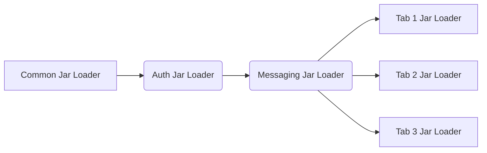

# Creating a project

## General settings

**Topic**: The topic you want to sent messages to or monitor.  
e.g `persistent://tenant/namespace/topic`  
**Service URL**:  The URL of the Pulsar service that the client should connect to  
e.g `pulsar+ssl://pulsar.eng.com:6651`

## Adding jars to a project

Pulseman allows you to add jars to a project, they are used in serialization/deserialization of messages and when
setting up authorization.

Separate Jar loaders are used so that each tab can have its unique set of Jars loaded and avoid conflicts. The following
Jar loaders are used.

- **Common jar loader**: Jars added here will be available project wide in all tabs.
- **Auth jar loader**: The auth jar loader has the common jar loader as a dependency and has all its jars loaded, it
  is used by the Auth code to filter for the Authorization class you want to use.
- **Messaging jar loader**: Holds global pulsar messaging jars, these are used for serialization/deserialization of
  messages and will be available in every tab. The jar loader is dependent on the auth jar loader.
- **Tab jar loaders**: Each tab has its own jar loader, this is used to load jars that are specific to the tab. This is
  dependent on the global messaging Jar loader.

### Hierarchy of jar loaders



The **Jars** button in the top pane contains the UI to add jars to the **Common** or **Auth** jar loaders.

If the **Protobuf** serialization option is selected you can add the messaging jars in the **Jars** tab on the bottom
pane.

*ProtoKt* clashes with the namespace of some standard google protobuf imports, to support them working side by side
in the same project the following gradle imports are loaded manually to the jar loader depending on what type of
protobuf class is selected for serializing/deserializing.

```
"com.google.api.grpc:proto-google-common-protos:$googleCommonProtos"
"com.toasttab.protokt.thirdparty:proto-google-common-protos:$protoktVersion"
```

## Importing Jars

There are two options to import a Jar, manually add the Jar through a file dialog or add the Jar through gradle.

### Manual import

In any of the **Jar** selection screen just select **Add Jar** and navigate to the Jar you want to import.

### Gradle import

You can import Jars through gradle by creating a `build.gradle.kt` configuration file like follows in one of the
**Gradle** tabs.

```kotlin
plugins {
    kotlin("jvm") version "2.0.21"
}

repositories {
    mavenCentral()
}

dependencies {
}
```

The files are written in `kotlin` scripting. You can add custom repositories and dependencies to the file.  
The files will be downloaded locally and copied to the projects directories.

### Global

Select the **Jars** button in the top pane and navigate to the **Gradle** tab. Any Jars added here will be available
project wide.  
Auth jars will be loaded in the **Auth** tab, messaging jars will be loaded in the **Message** tab and any others will
be added to the **Common** Jar loader automatically.

If you enable the `Filter Pulsar Jars` toggle, only Jars that contain classes that implement the pulsar interfaces will
be loaded, i.e. only the **messaging** and **auth** jars will be loaded.

### Tab specific

Select the **Gradle** tab in the bottom pan. Any Jars added here will only be available in the tab you are currently
in.  
You can only add messaging Jars, all other Jars will be filtered.

## Set up auth

If your pulsar set up utilizes authentication you can import your own Auth classes if they implement these apache pulsar
interfaces.  
[Authentication](https://pulsar.apache.org/api/client/org/apache/pulsar/client/api/Authentication.html)  
[EncodedAuthenticationParameterSupport](https://pulsar.apache.org/api/client/org/apache/pulsar/client/api/EncodedAuthenticationParameterSupport.html)

You will then need to provide your auth settings as a string, these will be passed to the **configure** method of the
**EncodedAuthenticationParameterSupport** interface at runtime.

### Steps

1. Import your jar in the **Auth** tab.
2. In the **Auth Settings** tab select the authentication class you want to use, if it doesn't show up it doesn't
   implement the correct interfaces.  
   If you want to disable auth unselect any classes here.
3. Still in the **Auth Settings** tab define your auth settings in the Auth parameters section.  
   This will be a user defined format, for the auth class you import.

## Define properties

You can also define an optional key/value map of user-defined properties sent in each message.

### Steps

1. Go to the properties tab.
2. Define a json map of key value pairs.

``` 
{
    "propertyKey": "propertyValue"
}
```

## Add a generic dependency jar

If you just want to add any dependency for use in serialization/deserialization/auth you can add it to the
**Common Jars** tab

## Searching for topics

If you select the magnifying glass icon and point it at your pulsar set up

e.g `http://localhost:8079`

You can pull down all the topics configured and select which one to use in the project.

## Import your messaging jars

Currently only
[protokt](https://github.com/open-toast/protokt/blob/main/protokt-runtime/src/main/kotlin/com/toasttab/protokt/rt/KtMessage.kt)
and
[GeneratedMessageV3](https://www.javadoc.io/static/com.google.protobuf/protobuf-java/3.5.1/com/google/protobuf/GeneratedMessageV3.html)
protobuf messaging formats are supported. You can import any jars that have classes implementing these interfaces.

### Steps

1. Select the **Jars** tab in any **Protobuf** test tab.
2. Add any jars containing your message classes.
3. In the **Class** tab you can now select any class to send a message or deserialize with.

If you want to use the same jars in multiple tabs you can add them to the **Common Jars** tab and reduce project size,
however be wary of conflicts.

## Send a message to a topic

### Protobuf

1. Import your message jar
2. Select your message class to send in the **Class** Tab.
3. In the **Send** tab select **Generate** to give a template for the message you want to send.
4. This is kotlin scripting code, the last value returned is what will be serialized and sent.  
   Create the message you want to send and hit **Compile**.
5. Hit the **Send** button, and you're done, hitting **Send** multiple times will send the same message unless you
   recompile.

### Text

1. Define the text format in the **Serialization** tab.  
   Note: Selecting Base64 will convert your text to base64, the other selections only encode to a specific character
   set.
2. Enter the text you want to send in the **Send** tab and press the **Send** button.

## Monitor a topic.

Each message decoded will show the pulsar properties of the message also.

### Protobuf

1. Import the message jar you wish to deserialize messages with.
2. In the **Class** tab select a class to decode messages with.
3. In the **Receive** tab every message on the topic will be decoded with the class selected, if you have a mismatch
   between the message contents and the selected class you may get garbled output.

### Text

1. Define the text format in the **Serialization** tab.  
   Note: Selecting Base64 will convert your text from base64, the other selections only decode a specific character set.
2. In the **Receive** tab every message on the topic will be decoded with the serialization method selected in step one.

## Convert logs

### Protobuf

Currently only protobuf log conversion is supported. Both base64 and HEX byte array representation can be converted.

1. In the **Class** tab select a class to decode messages with.
2. In the **Convert** tab select the format you wish to convert from.
3. Paste the text you wish to convert in the **Convert** tab and select **Convert**
