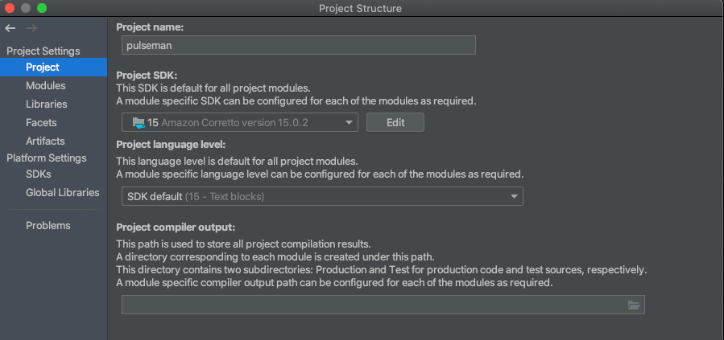

# pulseman

Pulseman(Pulsar manager) is an [Apache Pulsar](https://pulsar.apache.org/) test tool that allows users to

- Generate messages and send them to a pulsar topic using Kotlin Scripting
- Monitor/receive messages from a topic
- Query all topics(non-authenticated connections only at the moment)
- Import jars for serialization and deserialization of messages
- Import custom authentication jars
- Store and share test collections

Current formats supported for serialization and deserialization of messages.

- [protokt](https://github.com/open-toast/protokt/blob/main/protokt-runtime/src/main/kotlin/com/toasttab/protokt/rt/KtMessage.kt) (
  protobuf format)
- [GeneratedMessageV3](https://www.javadoc.io/static/com.google.protobuf/protobuf-java/3.5.1/com/google/protobuf/GeneratedMessageV3.html) (
  protobuf format)

Currently, this has only been tested and targeted to work on macOS.

## Getting Started

### Local development

Previous development was done in intellij with java SDK version 15.


### Create an unsigned distributable (mac)

When a stable build has been completed, generate a distributable installer with this gradle command:

```
./gradlew createDistributable
```

The file can be found in `build/compose/binaries/main/app/`. Note that the installer needs to be run on the target OS.

Install on a machine by dragging from where it is saved, onto the `Applications` in Finder. You may need to show
Favourites.

As mac apps need to be signed, the program cannot be started the standard way.  
Run it from Terminal with:

```
/Applications/Pulseman.app/Contents/MacOS/Pulseman
``` 

If run from the Applications folder, configuration files for the app by default will be stored in `~/pulseman_config`.  
Editing files in here manually may affect saved configurations and app functionality.

### Create a signed distributable (mac)

Steps on how to sign and notarize a mac app can be
found [here](https://github.com/JetBrains/compose-jb/tree/master/tutorials/Signing_and_notarization_on_macOS)

### Creating a project

See [CREATE-PROJECT](CREATE-PROJECT.md)

## Running the tests

Run the junit tests from the root folder as follows

```
./gradlew test
```

## Contributing

Please read [CONTRIBUTING](CONTRIBUTING.md) for details on our code of conduct, and the process for submitting pull
requests to us.

## Versioning

See [CHANGELOG](CHANGELOG.md) for a history of changes to this repo.

## Authors

[Stephen Kirk](mailto:stephen.kirk@toasttab.com),
[Paul Queruel](mailto:paul.queruel@toasttab.comron),
[Ronan Kileen](mailto:ronan.killeen@toasttab.com)  

## License

This project is licensed under the Apache 2 License - see the [LICENSE](LICENSE) file for details.

## Acknowledgments

[RSyntaxTextArea](https://github.com/bobbylight/RSyntaxTextArea) was super helpful for generating pretty code editors
quickly.

[Reflections](https://github.com/ronmamo/reflections) made parsing jars for classes super simple.

The name pulseman is an ode to [Postman](https://www.postman.com/).  
