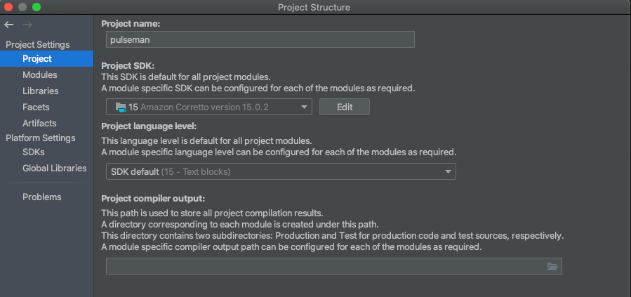

# Pulseman

Pulseman (Pulsar manager) is an [Apache Pulsar](https://pulsar.apache.org/) test tool that allows users to:

- Generate and publish messages to a pulsar topic using Kotlin Scripting
- Subscribe to a Pulsar topic and receive messages
- Query all topics (non-authenticated connections only at the moment)
- Import JAR files for serialization and deserialization of messages
- Import custom authentication JAR files
- Store and share test collections

Currently, this has only been tested and targeted to work on macOS.

## Supported formats

Current formats supported for serialization and deserialization of messages:

- [Protobuf messages](https://github.com/open-toast/protokt/blob/main/protokt-runtime/src/main/kotlin/com/toasttab/protokt/rt/KtMessage.kt) compiled with [protokt](https://github.com/open-toast/protokt)
- [Protobuf messages](https://www.javadoc.io/static/com.google.protobuf/protobuf-java/3.5.1/com/google/protobuf/GeneratedMessageV3.html) compiled with [protoc](https://developers.google.com/protocol-buffers)

## Getting Started

### Local development

Development of Pulseman is done using Java 15. In order for IntelliJ to work correctly and be able to run and debug the application you'll need to set the correct Java version.

Open IntelliJ and go to `File -> Project Structure` and set the `SDK` and `Language Level` to be Java 15.



### Create an unsigned distributable (macOS)

To create an unsigned distributable run this Gradle command:
```
./gradlew createDistributable
```

The resulting distributable can be found in `build/compose/binaries/main/app/`.

You can install it on your computer by dragging it into your `~/Applications` folder.

As macOS need applications to be signed to be run, you can't run it the usual way.
To run the application you'll need to run this command:
```
~/Applications/Pulseman.app/Contents/MacOS/Pulseman
```
If run from the Applications folder, configuration files for the application, by default, will be stored in `~/pulseman_config`.

#### Note
Editing these configuration files manually may corrupt your saved configurations and application functionnality.

### Create a signed distributable (macOS)

Steps on how to sign and notarize a macOS application can be
found [here](https://github.com/JetBrains/compose-jb/tree/master/tutorials/Signing_and_notarization_on_macOS).

### Creating a project

See [CREATE-PROJECT](CREATE-PROJECT.md)

## Running the tests

Run the JUnit tests from the root folder using the following command:

```
./gradlew test
```

## Contributing

Please read [CONTRIBUTING](CONTRIBUTING.md) for details on our code of conduct, and the process for submitting pull
requests.

## Versioning

See [CHANGELOG](CHANGELOG.md) for a history of changes to this repository.

## Authors

[Stephen Kirk](mailto:stephen.kirk@toasttab.com),
[Paul Queruel](mailto:paul.queruel@toasttab.comron),
[Ronan Kileen](mailto:ronan.killeen@toasttab.com)

## License

This project is licensed under the Apache 2 License - see the [LICENSE](LICENSE) file for details.

## Acknowledgments

[RSyntaxTextArea](https://github.com/bobbylight/RSyntaxTextArea) was super helpful for generating pretty code editors
quickly.

[Reflections](https://github.com/ronmamo/reflections) made parsing JAR files for classes super simple.

The name Pulseman is an ode to [Postman](https://www.postman.com/).  
